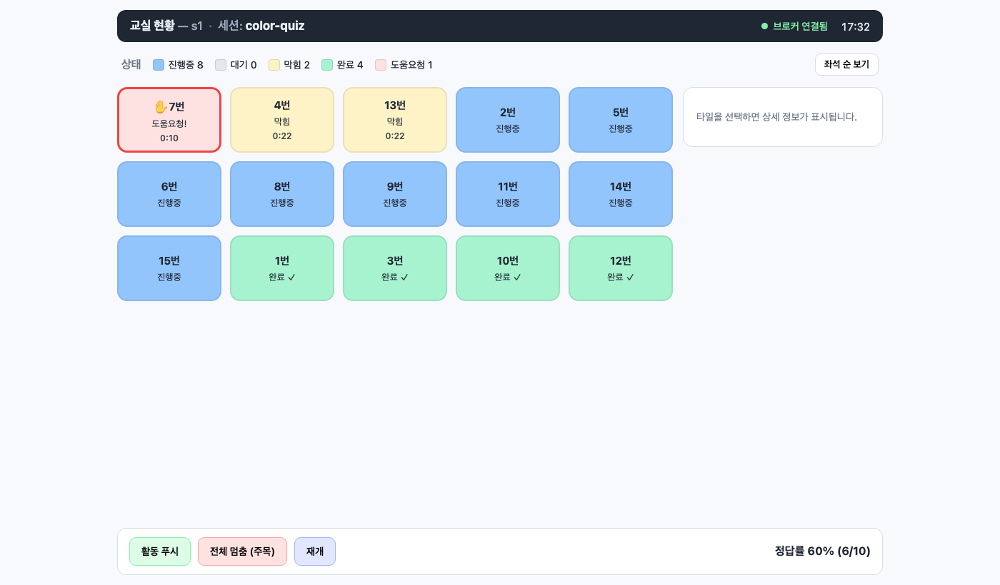

# R4 Swarm — Phase 1: Who's-Stuck 그리드 (e2e)

교사가 "누가 막혔나"를 한눈에 보는 실시간 그리드. 하드웨어 없이 **디바이스 시뮬레이터 → MQTT 브로커 → FastAPI 백엔드 → Vue 대시보드**가 랩톱에서 동작한다.

설계 근거·전체 로드맵: [`docs/README.md`](./docs/README.md) · 실행 분해: [`ROADMAP.md`](./ROADMAP.md) · API 계약: [`docs/API.md`](./docs/API.md)



> 7번 = 도움요청(빨강·최우선) · 4·13번 = 막힘(황색, 백엔드 자동 파생) · 진행중(파랑) · 완료(초록). 하단 정답률은 실시간 집계.

## 빠른 시작

```bash
# 1) 프론트 빌드 (백엔드가 dist를 / 에서 서빙)
cd frontend && npm install && npm run build && cd ..

# 2) 브로커 + 백엔드 + 시뮬레이터 한 번에 기동 (순수 파이썬, Docker 불필요)
uv run python run_dev.py

# 3) 브라우저
open http://localhost:8077
```

포트 변경: `PORT=9000 uv run python run_dev.py`.

### e2e 자동 검증 (스크린샷 포함)
```bash
PORT=8077 SHOT=/tmp/shot.png uv run --with playwright python verify_e2e.py
# 8/8 checks: ingest · stuck/help/done 파생 · WS 푸시 · 명령 왕복 · 스크린샷
```

## 구조
```
server/        FastAPI 백엔드
  contract.py    토픽·state enum·임계값 (단일 진실 소스)
  store.py       디바이스 스토어 + stuck/offline 파생 + 마스터리 집계
  app.py         MQTT 인제스트 → WebSocket 푸시 + REST /api/cmd
  dev_broker.py  amqtt 순수 파이썬 브로커 (dev)
sim/simulate.py  N대 보드 시뮬레이터 (state/answer 발행, 명령 반응)
frontend/        Vue3 + Vite 대시보드 (who's-stuck 그리드)
infra/           docker-compose Mosquitto(운영) + ACL/conf
run_dev.py       원커맨드 러너
verify_e2e.py    e2e 검증 + 스크린샷
```

## 동작 핵심
- **stuck은 디바이스가 보고하지 않는다 — 백엔드가 파생**: `working`인데 `idle_ms > 30s`면 막힘. `help`는 아이가 누른 명시적 신호로 항상 최우선.
- **state는 retained**라 늦게 접속한 대시보드도 즉시 현재 상태 복원.
- **명령 왕복**: 대시보드 버튼 → `POST /api/cmd` → MQTT `cmd/*` → 시뮬레이터 반응 → state 재발행 → 그리드 갱신.

## 운영 브로커(Mosquitto)로 전환
dev는 in-process amqtt를 쓴다. 운영은:
```bash
docker compose -f infra/docker-compose.yml up -d   # Mosquitto :1883
BROKER_HOST=localhost uv run uvicorn server.app:app --port 8077
BROKER_HOST=localhost uv run python -m sim.simulate
```
운영 보안(per-device user/pass + 토픽 ACL + TLS)은 `infra/mosquitto/` 및 `docs/README.md §6.5` 참조.

## 다음 (Phase 2~)
오케스트레이션 명령(그룹 푸시·페이싱) → 형성평가 심화 → 비문해 UX/피드백 → 실제 R4 펌웨어 → 보안/PIPA. [`ROADMAP.md`](./ROADMAP.md).
