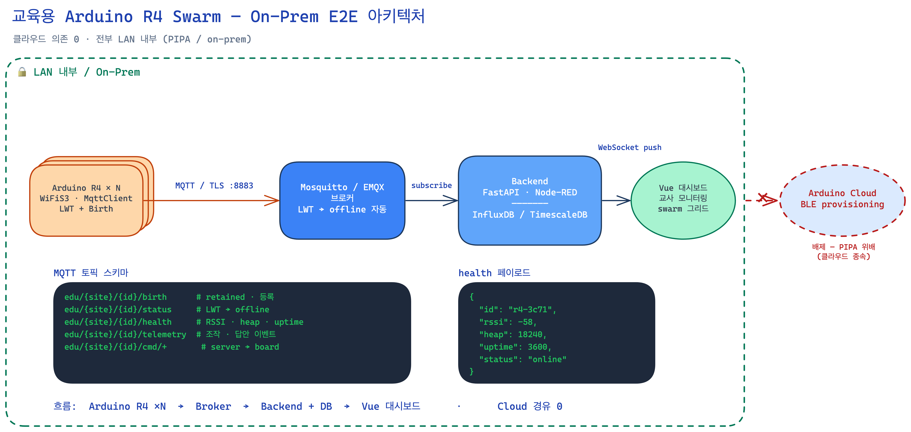
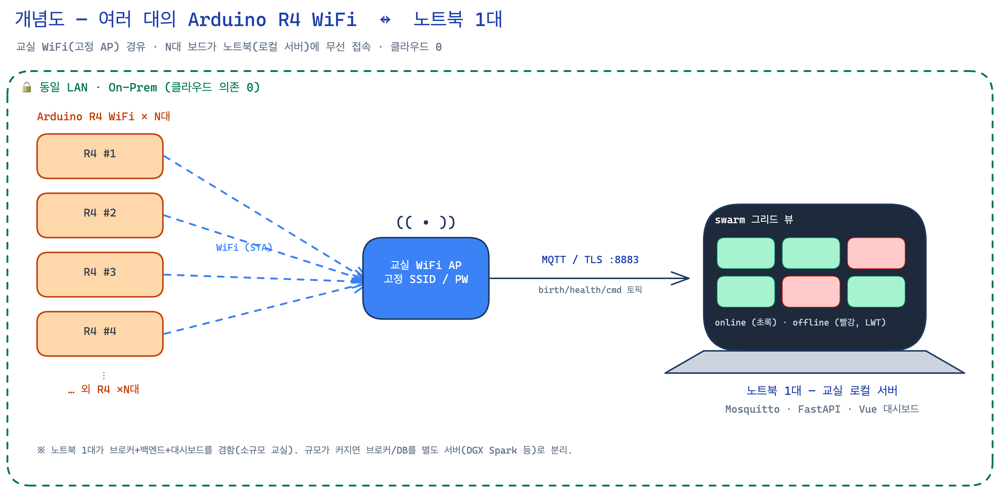
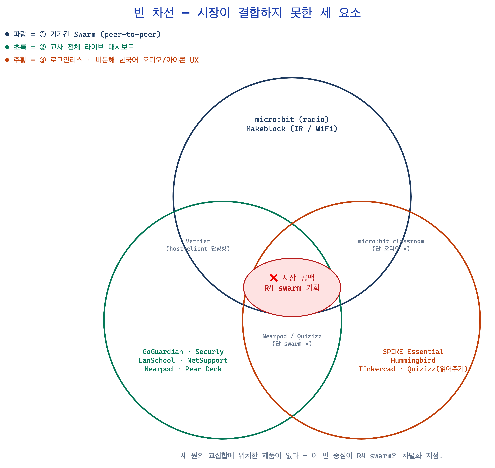
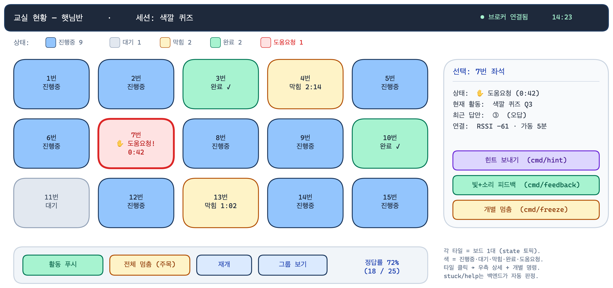

# 교육용 Arduino R4 Swarm — 종합 설계 문서

> 어린이집/유치원용 인터랙티브 보드 swarm(여러 대의 Arduino R4 WiFi + 교사 노트북)의
> 아키텍처 · 기능 적정성 · 전략 · 최우선 기능 설계를 하나로 모은 문서.
> 원본 요구사항: [`wifi-provision-guide.md`](./wifi-provision-guide.md) · 작성 2026-06-20 · 5건 병렬 리서치(교육 플랫폼 2 + 인프라 3) 종합.
> 다이어그램 원본(.excalidraw)은 [`assets/`](./assets) — excalidraw.com 또는 VS Code Excalidraw 확장에서 편집.

## 목차
1. [개요 (TL;DR)](#1-개요-tldr)
2. [시스템 아키텍처 (E2E)](#2-시스템-아키텍처-e2e)
3. [물리 구성 개념도 (N대 ↔ 노트북)](#3-물리-구성-개념도-n대--노트북)
4. [기능 적정성 & 갭 분석](#4-기능-적정성--갭-분석)
5. [전략 — 빈 차선(Open Lane)](#5-전략--빈-차선open-lane)
6. [최우선 기능 설계 — Who's-Stuck 그리드](#6-최우선-기능-설계--whos-stuck-그리드)
7. [부록 A — 인프라 검토 요약](#7-부록-a--인프라-검토-요약)
8. [다음 액션 / 로드맵](#8-다음-액션--로드맵)
9. [파일 인덱스](#9-파일-인덱스)

---

## 1. 개요 (TL;DR)

당신의 버튼-보드 swarm은 **본질적으로 "전 학생 응답 시스템(all-student response system)"**이고, 이것이 가장 큰 교육적 자산이다(형성평가 효과크기 0.4~0.7, 저성취 아동에 특히 효과 — Black & Wiliam). 인프라(MQTT/TLS/브로커)는 검증됐으나, 그 위 **교실 운영(orchestration) 기능 레이어**가 통째로 비어 있다.

시장 조사 결과 **"기기간 swarm + 교사 전체 라이브 대시보드 + 로그인리스 비문해 한국어 UX"를 한 번에 제공하는 제품이 없다** — 여기가 빈 차선이자 차별화 지점. 인프라를 더 만지기 전에 **이 기능 레이어를 설계하는 것이 ROI 최대**이며, 그중 최우선은 **"누가 막혔나" 실시간 그리드**(근거 최강, Lumilo).

---

## 2. 시스템 아키텍처 (E2E)



**데이터 흐름** (전부 LAN 내부, 클라우드 0):

```
Arduino R4 ×N  ──MQTT/TLS:8883──>  Mosquitto/EMQX 브로커  ──>  Backend + DB  ──>  Vue 대시보드
(WiFiS3·MqttClient·                (LWT→offline 자동)        (FastAPI·Node-RED   (교사 모니터링)
 LWT+Birth)                                                   +Influx/Timescale)
```

- **핵심 주장**: 초록 점선 LAN 경계가 전체를 감싸고, Arduino Cloud는 경계 밖에서 차단(PIPA 위배 → 배제). 클라우드 의존 0.
- **liveness 3종**: Birth(retained "online") + LWT(비정상 단절 시 자동 "offline") + Retained. polling 없이 실시간 생존 가시성.
- **MQTT 토픽(기존)**: `edu/{site}/{id}/{birth,status,health,telemetry,answer,cmd/+}`

> 인프라 적정성 결론: **베이스라인은 대체로 옳다.** Mosquitto·MQTT+TLS·on-prem 모두 이 규모에 적절. 자세한 검토는 [부록 A](#7-부록-a--인프라-검토-요약).

---

## 3. 물리 구성 개념도 (N대 ↔ 노트북)



- N대 Arduino R4 WiFi가 **교실 WiFi AP(고정 SSID)** 경유로 **노트북 1대**(교실 로컬 서버)에 무선 접속.
- 노트북 1대가 **브로커 + 백엔드 + 대시보드**를 겸함(소규모 교실). 규모가 커지면 브로커/DB를 별도 서버로 분리.
- 노트북 화면 = swarm 그리드 뷰(online 초록 / offline 빨강).

---

## 4. 기능 적정성 & 갭 분석

### 4.1 경쟁 플랫폼이 실제 제공하는 기능

17개 플랫폼(로봇/피지컬컴퓨팅 8 + 오케스트레이션 5 + 화면관리 4)을 12개 범주로 매핑.

| 기능 범주 | 카테고리 리더 | 시사점 |
|---|---|---|
| 전체 실시간 모니터링 | GoGuardian·Securly·LanSchool(썸네일 그리드), Nearpod/Pear Deck | **교사 최고가치** |
| 콘텐츠 푸시/브로드캐스트 | 화면관리툴, micro:bit, Nearpod | 전체/그룹 푸시 |
| 잠금/멈춤/페이싱 | 화면관리툴(freeze), Nearpod(페이싱), **micro:bit(pause-all 유일)** | "주목" 통제 |
| **형성평가 즉시집계** | Quizizz(저정답 학생 강조), Kahoot, Nearpod | **교육 핵심** |
| 차등화/그룹배정 | GoGuardian Scenes, Securly 그룹 | 적응형은 전부 수동 |
| 게이미피케이션 | Kahoot, Quizizz | ⚠️ 연령 주의 |
| **기기간 swarm** | **micro:bit(radio)**, Makeblock(IR/WiFi) | **빈 차선 핵심** |
| 교사+부모 리포트 | 부모: Quizizz·LanSchool Air·Sphero만 | 로봇계열엔 거의 없음 |
| 비문해 아동 UX | Hummingbird·SPIKE Essential(아이콘/촉각), Quizizz(읽어주기) | 오디오가 갈림길 |
| 로그인리스 빠른참가 | **micro:bit, Tinkercad, Vernier**, 오케스트레이션 전부 | 비문해엔 필수 |

**swarm 결정적 사실**: 아이가 프로그래밍하는 기기간 통신은 micro:bit(radio)·Makeblock(IR/WiFi)뿐. SPIKE·Sphero·mBlock은 "앱1↔로봇1". Vernier는 host→client 단방향. 오케스트레이션·화면관리툴은 swarm 전무.

### 4.2 아동·교사 관점 필요 기능 (근거 기반)

**아동(비문해 가능):**
- **<100ms 다감각 즉시 피드백**(빛+소리, 색/소리=정답신호) — 이중부호화(Mayer), 100ms=즉각(Nielsen). [강]
- **비문해 UX** — 물리 타깃 ≥2cm, 단일 누름, 오디오+아이콘(텍스트 X). [강]
- **한입크기·턴제** — 주의지속 ≈ 연령당 2~3분. 작은 난이도 증가가 자기효능감↑.
- **스캐폴딩/힌트(Goldilocks)** — 단계적 힌트+제한(답 바로 주면 "게이밍"으로 학습↓). [강]
- ⚠️ **보상 주의** — 이 연령대에서 기대된 상품/리더보드는 내재동기 훼손 최대(Deci 메타, Lepper). → 노력·진전 축하로. [강]
- **NAEYC/DAP**: 누르는·또래협동·교사주도 *물리* 기기는 권장하는 "능동·사회적 사용"(단 짧고 공유적으로).

**교사(Orchestration):**
- **"누가 막혔나" 한눈 그리드 = 최고가치** — Lumilo(AIED 2018): 실시간 도움필요 표시가 측정된 학습 향상으로. working/idle/stuck/done/help 색상 타일. [강]
- **원터치 전체/그룹 푸시 + 전체멈춤("eyes on me")** [실무/강]
- **실시간 형성평가·마스터리 뷰** — 교사의 #1 장벽(시간·학급규모) 제거. [강]
- **로그인리스 빠른 회전**(micro:bit 선례) — 비문해 아동은 ID 타이핑 불가 → 이중 필수. [강]
- **설계 원칙(Dillenbourg)**: 미니멀리즘·가시화·**교사를 대체가 아니라 보강**(보여주되 대신 판단 X).

### 4.3 현재 가이드의 기능 공백 (배관은 있으나 기능 부재)

| 공백 | 영향 |
|---|---|
| ❌ "도움요청/막힘" 상태 신호 | 교사 오케스트레이션 #1 가치 누락 |
| ❌ 그룹 추상(토픽이 per-device뿐) | 차등화·그룹 푸시 불가 |
| ❌ 형성평가 집계/마스터리 뷰 | "반 정답률·누가 막힘" 없음 |
| ❌ 전체멈춤/페이싱 명령 | "주목" 통제 불가 |
| ❌ 다감각 피드백 루프 설계 | 아이 동기·정답신호 없음 |
| ❌ 비문해 UX 설계 | 어린이집에 치명적 |
| ❌ 레슨 저작/시퀀싱, 부모 리포트 | — |

---

## 5. 전략 — 빈 차선(Open Lane)



시장이 **결합하지 못한** 세 요소의 교집합 = 당신의 기회:

1. **진짜 peer-to-peer swarm + 교사 전체 라이브 대시보드를 한 제품에** — 어디도 안 됨.
2. **swarm을 로그인리스·비문해(오디오/아이콘) 흐름 안에** — micro:bit가 근접하나 **오디오 내레이션 없음.**
3. **로봇/swarm 플랫폼의 부모 리포트** — 거의 전무.
4. **한국어 UI + 오디오** — 비문해용 네이티브 한국어 오디오는 미충족 니치.

> "R4 swarm을 ESP32 도구로 복제"가 아니라, **시장에 없는 결합(swarm × 라이브 대시보드 × 비문해 한국어 UX)을 만드는 것**이 전략적으로 옳다.

---

## 6. 최우선 기능 설계 — Who's-Stuck 그리드

근거가 가장 강한 교사 기능(Lumilo). 설계 원칙: **보여주되 대신 판단하지 않는다**(Dillenbourg).



### 6.1 상태 모델 (5-state)

| state | 의미 | 누가 설정 | 색 |
|---|---|---|---|
| `idle` | 대기 | 디바이스 | 회색 |
| `working` | 진행 중 | 디바이스 | 파랑 |
| `stuck` | 진전 없음 | **백엔드 자동 판정** | 황색 |
| `done` | 완료 | 디바이스 | 초록 |
| `help` | 아이가 도움 버튼 | 디바이스(명시적) | 빨강(굵은 테두리) |
| *(offline)* | 연결 끊김 | 브로커 LWT | 흐림 |

> **`help`(아이가 손든 *명시적* 요청)와 `stuck`(조용히 막힘, *추론*)을 분리하는 것이 핵심.** 후자가 Lumilo가 증명한 가치 — 놓치기 쉬운 아이.

### 6.2 토픽 (기존 트리에 추가)

```
edu/{site}/{id}/state          # ★ 핵심 — retained, QoS1 (타일을 그리는 단일 진실 소스)
edu/{site}/{id}/meta           # {group_id, seat_color, seat_no} retained
edu/{site}/{id}/cmd/feedback   # 교사→보드 빛/소리 넛지
edu/{site}/{id}/cmd/hint       # 단계 힌트
edu/{site}/{id}/cmd/freeze     # 개별 멈춤/재개
edu/{site}/group/{g}/cmd/+     # push_activity|freeze|resume|pace
edu/{site}/group/{g}/mastery   # 백엔드 집계 결과
edu/{site}/session/{sid}/+     # start|end
```

### 6.3 페이로드 스키마

**`state`** (디바이스 → 브로커, retained, QoS1):
```json
{ "st": "working", "act": "color-quiz", "q": 3,
  "since": 1718900000, "idle_ms": 4200, "seq": 87 }
```
디바이스는 `idle/working/done/help`만 보고. **`stuck`은 백엔드가 파생**. `help`는 도움 버튼 인터럽트 시 즉시 publish(디바운스 300ms).

**`cmd/feedback`**: `{ "led":"green", "blink":2, "sound":"chime", "ms":800 }`
**`cmd/hint`**: `{ "level":1 }` (1=빛 넛지, 2=방향, 3=정답 근접)
**`group/{g}/mastery`**: `{ "act":"color-quiz","q":3,"n":25,"correct":18,"rate":0.72,"stuck":2,"help":1 }`

### 6.4 stuck 자동 판정 & 신뢰성

- 백엔드: `working` 상태에서 `idle_ms > THRESHOLD`(활동별 30~60s) → 대시보드에 stuck. `help`는 항상 최우선. `done/idle`은 리셋. LWT(offline) → 타일 흐림.
- THRESHOLD는 활동 난이도별·교사 슬라이더 조절. stuck은 "추론"이므로 부드럽게(색만, 오탐 시 무시 가능).
- **MQTT 5 Will Delay Interval**(~8s)로 교실 WiFi 깜빡임에 의한 가짜 offline 제거. `state/meta/mastery`는 retained.
- ArduinoMqttClient는 자동 재접속 없음 → `poll()` ≤10s + 지터 지수 백오프.

### 6.5 브로커 ACL & PIPA 가드레일

- Mosquitto Dynamic Security: 디바이스 principal은 자기 네임스페이스만(`edu/{site}/{id}/#`), **와일드카드 구독 금지**(아동 데이터 유출 방지). 대시보드/백엔드만 광역 구독.
- 토픽/페이로드는 **기기·좌석 단위만**(chip-ID, seat_no, 값). **아동 이름·매핑은 분리된 접근통제 저장소**에만, 교사 RBAC + 접속기록.
- retained 메시지에 아동 PII 금지(상태·집계만).

### 6.6 MVP 구현 순서

1. **펌웨어**: `state` publish(변화+하트비트) + 도움 버튼 → `help` + 로컬 즉시 LED/소리.
2. **백엔드**: state 수집 + stuck 타이머 파생 + LWT offline.
3. **대시보드**: 타일 그리드(색·정렬·help 강조) + retained 복원.
4. **개별 명령**: `cmd/feedback`(빛+소리 넛지).
5. **집계**: `answer` → `mastery` + 하단 정답률.
6. **그룹/글로벌**: `group/{g}/cmd`(push_activity·freeze·resume).

> 1~3만으로도 "누가 막혔나 한눈에"라는 최고가치 기능이 동작. 4~6은 점증.

---

## 7. 부록 A — 인프라 검토 요약

> 사용자 우선순위에서 보류했으나 검증된 핵심만 보존. (OTA/보안은 "지금 당장 중요치 않음"으로 보류됨.)

**적정성**: 베이스라인은 대체로 옳음. Mosquitto(50대엔 충분, EMQX 불필요)·MQTT+TLS·on-prem 모두 적절.

**검증된 사실 / 교정**:
- **OTA는 R4에서 로컬로 가능**(공식 `OTAUpdate` 라이브러리가 자체 HTTP 서버에서 `.ota` pull). 단 단일 슬롯·롤백 없음·플래시 절반 → 비기술 인력 환경에선 USB 재플래시가 더 안전할 수 있음.
- **MAC 버그는 코어 1.1.0에서 수정**(과거 zero/바이트역순 이슈 해결). 코어 버전 pin 권장.
- **mTLS는 R4에서 불가**(`WiFiSSLClient`가 클라이언트 인증서 제시 불가, 이슈 #499) → **서버인증 TLS + 디바이스별 user/pass + ACL + VLAN**을 *대체* 통제로.
- **RTC 드리프트 ~2초/분**(크리스털 없음) → **로컬 NTP 서버** 주기적 재동기 사실상 필수.
- **32KB SRAM의 "TLS+MQTT 동시" 우려는 과장** — TLS는 ESP32-S3 보조칩에서 처리. 실제 압박은 MQTT 버퍼/String 단편화.
- **BLE+WiFi 동시 불가** → 프로비저닝은 시분할.
- **ArduinoMqttClient**: QoS 0/1/2 지원, **자동 재접속 없음**, MQTT5 미지원(라이브러리 한계).

**프로비저닝(고정 SSID 어린이집)**: 단일 이미지 플래시 + 칩-ID 기반 런타임 식별(per-board 커스터마이즈 0) + AP-모드 captive-portal 폴백(SSID 변경 대비).

**보안/PIPA(보류, 요지)**: 단방향 TLS+계정/비번은 전송 baseline일 뿐. PIPA 안전성 확보조치 전체로는 접속기록(≥1년)·사람단위 RBAC·내부관리계획·보관/파기·**아동 §22-2 법정대리인 동의**가 추가 필요. Arduino Cloud는 국외이전 → 배제.

**기능과 직접 닿는 인프라 옵션**:
- **ThingsBoard CE**: 교사 그리드 + 기기별 명령(RPC) 버튼을 *기성품*으로 — 커스텀 Vue 전 검토(단 JVM+8GB).
- **MQTT5 Will Delay**: 가짜 offline 제거 → 모니터링 신뢰도 직결([6.4](#64-stuck-자동-판정--신뢰성)).

---

## 8. 다음 액션 / 로드맵

1. **`state` 토픽 + who's-stuck 그리드**부터 (최고 ROI, 근거 최강) — [6장](#6-최우선-기능-설계--whos-stuck-그리드) MVP 1~3.
2. **answer → 마스터리 집계** (응답 시스템의 본질적 강점 실현).
3. **그룹 추상 + 원터치 푸시/전체멈춤** (오케스트레이션 원시기능).
4. **비문해 피드백 루프**(빛/소리/≥2cm/오디오) 펌웨어 설계 가이드라인.
5. micro:bit classroom을 직접 써보며 UX 레퍼런스화.

---

## 9. 파일 인덱스

| 파일 | 내용 |
|---|---|
| `docs/README.md` | (이 문서) 종합 마스터 |
| `docs/wifi-provision-guide.md` | 원본 요구사항 브리프 |
| `docs/assets/r4-swarm-architecture.{excalidraw,png}` | E2E 아키텍처 다이어그램 |
| `docs/assets/r4-laptop-concept.{excalidraw,png}` | N대 보드 ↔ 노트북 개념도 |
| `docs/assets/open-lane.{excalidraw,png}` | 빈 차선 벤다이어그램 |
| `docs/assets/whos-stuck-wireframe.{excalidraw,png}` | 교사 대시보드 와이어프레임 |

> `.excalidraw`는 [excalidraw.com](https://excalidraw.com) 또는 VS Code Excalidraw 확장에서 열어 편집.
